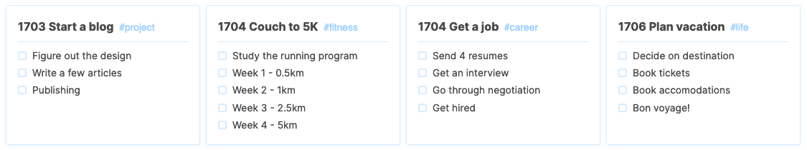

<Figure cover>

</Figure>

Video games tell you what to do using _quests_ or _missions_. There's no reason this can't work in real life, too. Books tell us to lead purpose-driven lives with long-term and short-term goals. Seems like a perfect way to make your life an RPG.

## Missions

A _mission_ is an achievable goal within 3 months or less. A mission should be broken down into sub-tasks. In other words, it's an actionable short-term goal.

<Figure cover>

</Figure>

I prefix each mission with a projected date of completion (`1702` is 2017, February), but this is totally up to you. I do this to get a good retrospective at the end of the year of all the missions I've completed.

## Keeping track

This system is so simple, you can use anything to keep track of it. As an Android user, I prefer using [Google Keep](https://keep.google.com). It lets me view all my missions at a glance, both ongoing and completed.

<!-- <Figure>

</Figure> -->

There are a variety of other ways to keep track of your missions, including using plain notebooks and pens. What's important is you break your goals into manageable pieces, and give yourself a way to look back on your progress.
