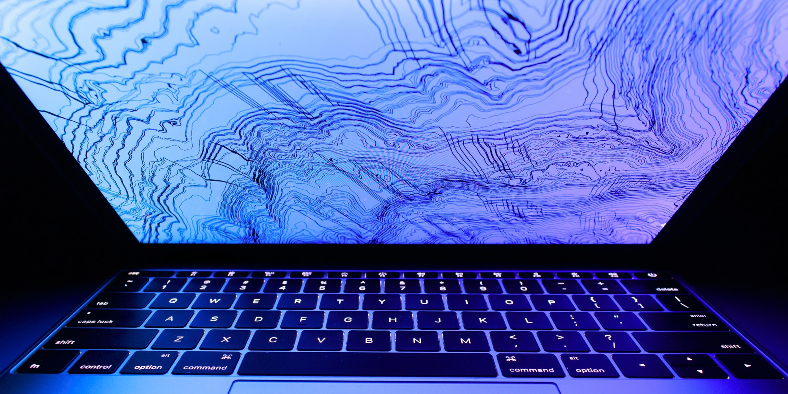

<Figure cover>

</Figure>

Getting fractional scaling right in Xorg is tricky, but possible. The solution
that works for me comes in 2 parts.

1. **Enlarge UI and text by 200%** &mdash; Use Xresources + GDK + QT env vars to
   scale everything by 200%. You can't adjust this without restarting apps. This
   200% shouldn't be changed; for fractional scaling, we will scale down the
   display instead in the next step.

2. **Scale your display down as needed** &mdash; Use xrandr to scale things down
   by 75%, or whatever ratio you like. This can be adjusted on the fly, and can
   be applied per-display.

In the example above, you'll have a 150% screen scale (200% &times; 75% = 150%).

## UI scaling

There are 3 solutions to changing UI scaling in Xorg. Each one affects different
things, so we'll need to combine them appropriately. These things can either
scale text (ie, increase font sizes) or scale UI elements (ie, increase "pixels"
in margins and paddings).

<Figure table>

| Apps                          | Xresources | GDK env vars | QT env vars |
| ----------------------------- | ---------- | ------------ | ----------- |
| Firefox & Chrome              | UI & Text  | UI & Text    |             |
| GTK apps (eg, Thunar)         | Text       | UI & Text    |             |
| Regular Xorg apps (eg, urxvt) | Text       |              |             |
| QT apps (eg, Dolphin, Krita)  | Text       |              | UI & Text   |

</Figure>

We'll update the Xresources config file to tackle `Xresources`,
and we'll set some environment variables to tackle `GDK` and `QT` scaling.

## Part 1: Enlarging UI and text

Place this in `~/.profile`. These variables will take effect when you log in.

<Figure code title='~/.profile'>

```sh
export GDK_SCALE=2
export GDK_DPI_SCALE=0.5
export QT_AUTO_SCREEN_SET_FACTOR=0
export QT_SCALE_FACTOR=2
export QT_FONT_DPI=96
```

</Figure>

Place this in `~/.Xresources`. These will take effect on your next log in.

<Figure code title='~/.Xresources'>

```sh
Xft.dpi: 192
Xcursor.size: 32
```

</Figure>

These two things combined will make all your apps display 2x as large. If you want to have a scaling of 200%, then congrats—you're done! If you'd like to have fractional scaling (eg, 150% or 175%), then move onto the next section.

<details>

<summary>Explanation</summary>

### Set Xresources scaling

Set `Xft.dpi` in your Xresources to scale up fonts in almost all Xorg apps.

```sh
Xft.dpi: 192
Xcursor.size: 32
```

- This scales fonts up by 2x. The default is 96dpi, so `192` is 2x that.

- This affects fonts only, not UI elements. It only scales fonts. In effect,
  apps (eg, Nautilus, Thunar) will look like they have huge text, but UI
  elements will not scale up.

- Firefox and Chromium will look okay with just this. UI elements will be scaled
  along just fine.

- If you do this on the fly (`echo "Xft.dpi: 192" | xrdb -merge -`), it will
  affect apps that will be started after that change.

### Set GDK scaling

Scale GTK apps using some environment variables.

```sh
export GDK_SCALE=2
export GDK_DPI_SCALE=0.5
```

This makes GTK apps look okay when combined with Xresources above.

- `GDK_SCALE` will enlarge both text and UI elements by 2x, effectively making
  text up 4x now when combined with Xresources above.

- `GDK_DPI_SCALE` will reduce text elements by 2x.

- Using `GDK_SCALE` alone, without the Xresources above or `GDK_DPI_SCALE`
  setting, will scale GDK apps properly. However, not GTK apps will be left
  behind, eg, urvxt.

### Set QT scaling

Scale QT apps using some environment variables.

```sh
export QT_AUTO_SCREEN_SET_FACTOR=0
export QT_SCALE_FACTOR=2
export QT_FONT_DPI=96
```

- This manually forces QT scaling by 2x. By setting `QT_AUTO_SCREEN_SET_FACTOR`,
  we disable QT's automatic DPI adjustments.

- This affects QT apps.

</details>

## Part 2: Scaling the display down

After enlarging your UI by 2x, you can use `xrandr` to scale it down to your desired size. This example below gets you an effective scale of 175%. (2 / 1.75 = ~1.14)

<Figure code title='~'>

```sh
xrandr --scale '1.14x1.14'
```

</Figure>

Note that not all versions of Xorg might support this. For older versions, the tool [x11-fractional-display-scaling](https://github.com/burntcustard/x11-fractional-display-scaling) can help.

<!--

After enlarging your UI by 2x, you can use `xrandr` to scale it down to your desired size. The tool [x11-fractional-display-scaling](https://github.com/burntcustard/x11-fractional-display-scaling) will automate this for you.

This example below gets you an effective scale of 175%. (2 / 1.75 = ~1.14)

```sh
bash display_scale.sh 1.14
```

### Manually

You can also do this manually without an external script. All it does is use `xrandr` with `--scale` and `--panning`.

<details>

We've scaled everything up by 2x, but you may want to show 1.75x instead. Use
`xrandr` to scale it down appropriately, even on a per-screen basis!

If we want an effective scale of 175%, we will have to set xrandr scale to
`1.14`, which is `2 / 1.75`. You can also set this on a per-output basis, so
each output would scale differenty.

```sh
scale="1.14"  # ie: 2.0 / 1.75

# The original resolution of your monitor
width=1920
height=1080

# The dimensions above, multiplied by $scale
panwidth="$(echo "scale=0; $width * $scale / 1" | bc)"
panheight="$(echo "scale=0; $height * $scale / 1" | bc)"

xrandr \
  --output eDP1 \
  --scale "${scale}x${scale}" \
  --panning "${panwidth}x${panheight}"
```

Here's an example of what that might be doing:

```sh
xrandr --output eDP1 --scale 2x2 --panning 2732x1536
```

</details>

-->

---

## Resources

- https://wiki.archlinux.org/index.php/HiDPI
- https://github.com/burntcustard/x11-fractional-display-scaling
- https://blog.summercat.com/configuring-mixed-dpi-monitors-with-xrandr.html
