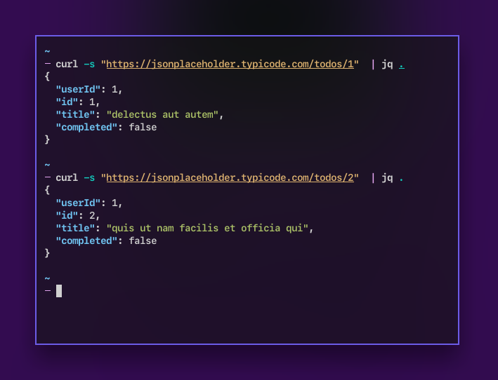

<figure class='cover'>

</figure>

View JSON output in the command line using [jq] together with _less_. This makes JSON output more readable.

## Setting it up

Use [jq] with _less_ to make view JSON output better. Using `-C` with _jq_ will force colors, and `-R` with _less_ will print colors.

```bash
# For bash and zsh shells
alias jless='jq -C . | less -R"
```

```bash
# For fish shell
abbr jless 'jq -C . | less -R"
```

Use this `jless` alias to make better sense of Docker's output:

```bash
docker ps --format '{{ json . }}' | jless
```

[jq]: https://stedolan.github.io/jq/
