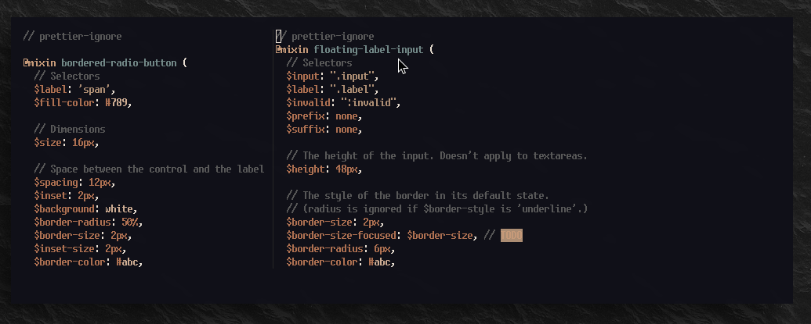
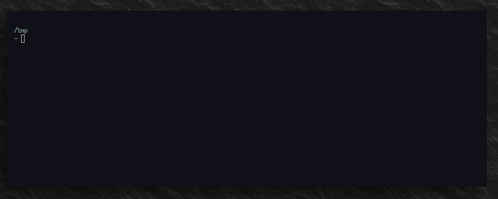
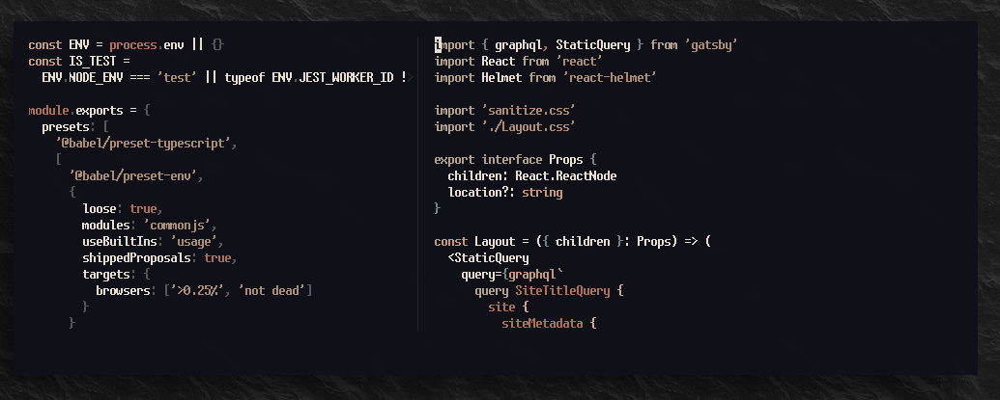

<figure class='cover'>

</figure>

I like using [Startify] not just as a pretty splash screen, but also as a session manager and project switcher. Here's how to use it.

[startify]: https://github.com/mhinz/vim-startify

## Getting started

### Installing Startify

Install Startify in your vim configuration. Here's how you would do it with vim-plug.

```vim
Plug 'mhinz/vim-startify'
```

## Saving sessions

Save your current session using `:SSave`.

<figure class='-wide'>

</figure>

## Loading sessions

The next time you start `vim` (or `nvim`), you will see a screen of your saved sessions.

<figure class='-wide'>

</figure>

## Switching sessions

From a running Vim session, you can use `:SClose` to switch to a different project. Bonus: by default, this will also save your current session if it's already saved.

<figure class='-wide'>

</figure>

## Bonus extras

### Key bindings

<!-- {.-wider-literate-style} -->

Set up some keybindings. I like these Spacemacs-inspired leader key bindings, but feel free to use any.

```vim
" `SPC l s` - save current session
nnoremap <leader>ls :SSave<CR>

" `SPC l l` - list sessions / switch to different project
nnoremap <leader>ll :SClose<CR>
```

### Extra configuration

<!-- {.-wider-literate-style} -->

Here's some extra config you can try!

```vim
" 'Most Recent Files' number
let g:startify_files_number           = 18

" Update session automatically as you exit vim
let g:startify_session_persistence    = 1

" Simplify the startify list to just recent files and sessions
let g:startify_lists = [
  \ { 'type': 'dir',       'header': ['   Recent files'] },
  \ { 'type': 'sessions',  'header': ['   Saved sessions'] },
  \ ]

" Fancy custom header
let g:startify_custom_header = [
  \ "  ",
  \ '   ╻ ╻   ╻   ┏┳┓',
  \ '   ┃┏┛   ┃   ┃┃┃',
  \ '   ┗┛    ╹   ╹ ╹',
  \ '   ',
  \ ]
```
