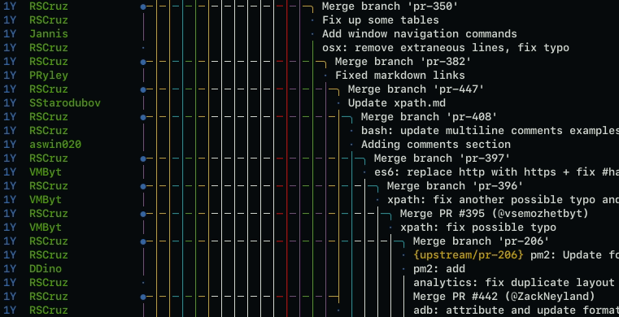

Many of us have been frustrated with [Guitar Hero]-like git graphs. These are usually made by tools that can't tidy up the graphs. There's a way to make them readable!

<Figure cover>

</Figure>

[Tig] is a fantastic tool for visualizing Git trees in the command line. Press `shift-g` to switch the commit graph to _v1_, which simplifies the graph. The example above shows the same fragment of Git history, but changing how it's visualized will make it apparent that it's simply a few PR's being merged en masse.

### Try it out yourself

Try Tig out in your package manager! For MacOS, it's available as `brew install tig`. For Linux, it's available in most distro's repositories.

[guitar hero]: https://twitter.com/henryhoffman/status/694184106440200192?lang=en
[tig]: https://github.com/jonas/tig
